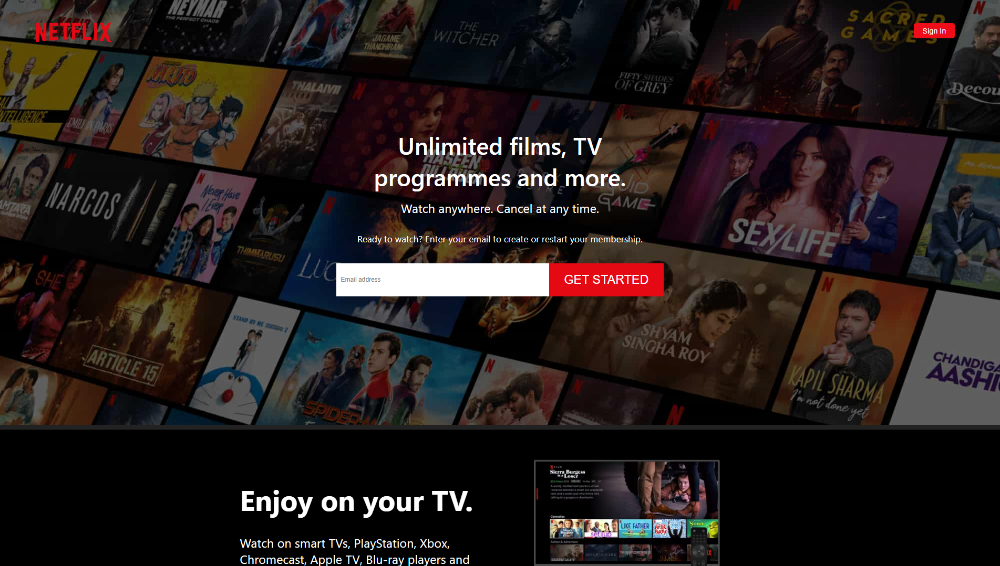
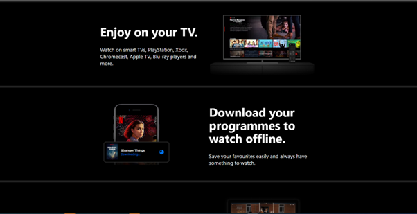
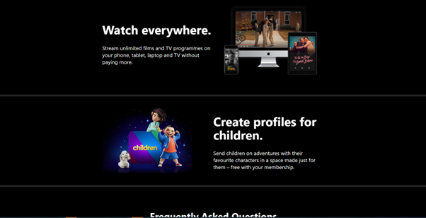
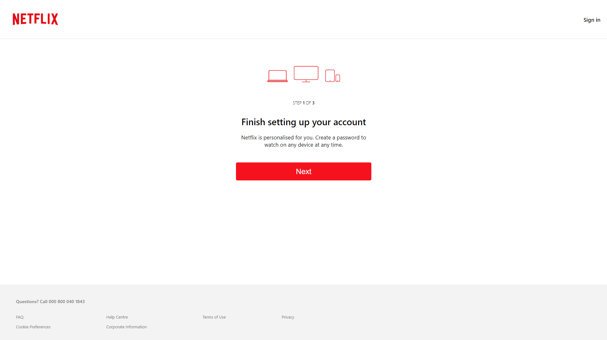
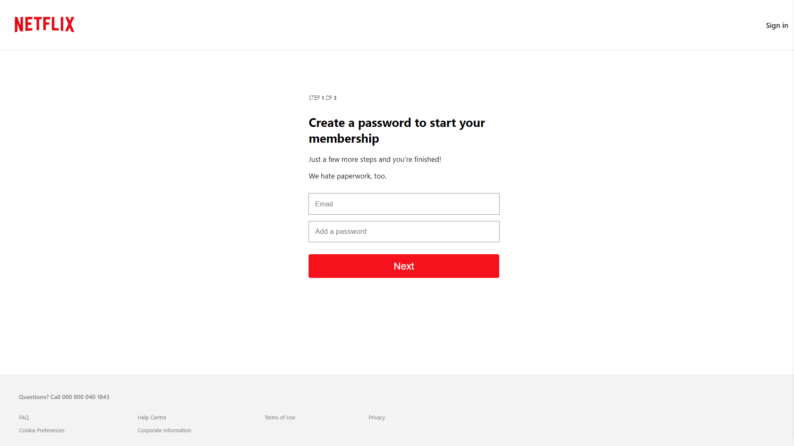

# Netflix UI Design Clone
- I have created a clone of the Netflix landing page and sign up pages using React and Styled Components.
- The aim was to practise creating responsive UI designs with Styled Components and create reusable components.

# To do list
- Create a login page
- Implement Firebase authentication
- Logout functionality
- Integrate the Movie Database Api to display films and series.
- Add a carousel functionility

      
