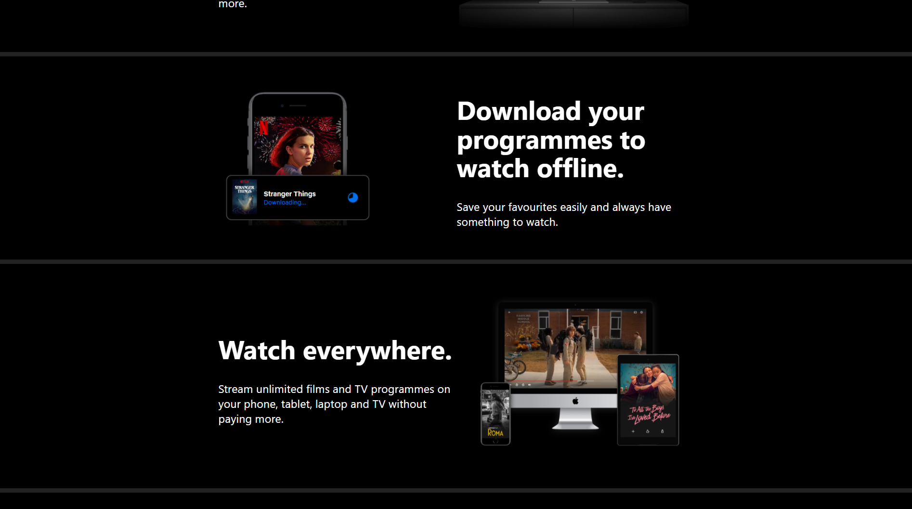
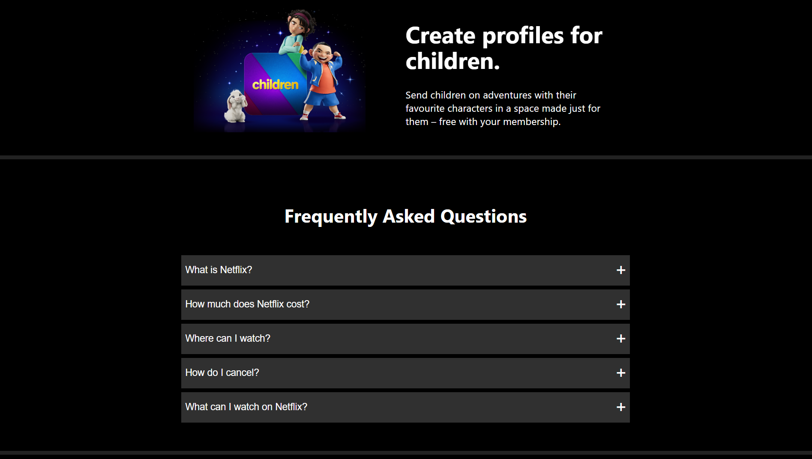

# Netflix UI Design Clone
- I have created a clone of the Netflix Landing page and sign up changes using React and styled components.
- The aim was to practise creating responsive UI with styled components and create reusable components.

# To do list
- Add a sign up and signin page using Firebase authentication
- Logout functionality
- Integrate the Movie Database Api to display films and series.
- Add a carousel functionility

      
